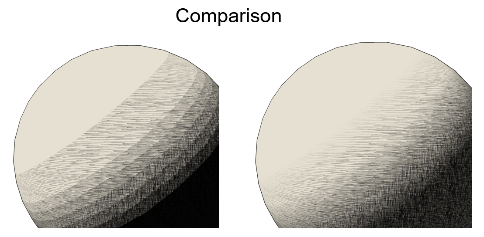

# Unity-Sketch-Style-Shader
Non-photorealistic shader for Unity 5. It simulates pencil strokes using a customized tone-mapping scheme.
Based on [nkihrk's](https://github.com/nkihrk/HatchingShader), the original paper could be found at [acm](https://dl.acm.org/doi/abs/10.1145/383259.383328).

# Usage

Applied this shader to the 3D object, then in Unity inspector, set the Hatch1~5 as the [texture provided](./img). 

## Parameters  

- Hatch0～5...... Paste the created TAM (Tonal Art Map). You can create your own TAMs, referring to the [paper](https://dl.acm.org/doi/abs/10.1145/383259.383328)
- Outline Mask Texture...... Any outline to delete. Prepare a black background and fill the area you want to erase in white.
- Outline Color...... Sets the color of the outline. 
- Outline Width...... Sets the width of the outline (depending on magnitude of the model).
- Threshold...... Limits the effect of the light color of the world light by a threshold. (suggestion: do not modify this)
- Density...... You can adjust the tint of the shadows.
- Roughness...... You can adjust the roughness of the shadows.
- Toggle Gray Scale...... Make the color grayscale.
- Cull Mode...... Cull can be set
- Blend Factor...... Controls the smoothness of tone transition, from 1 to 10. 1: no smoothness, 10 smooth transition (see figure below).

